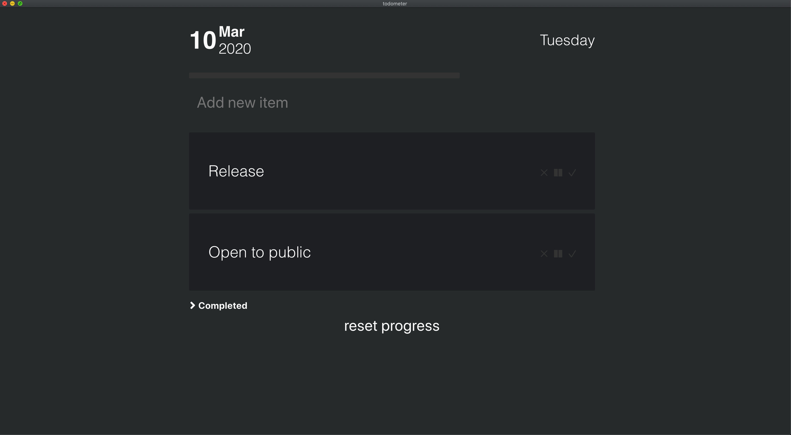

# dofour

A simple, meter-based to-do list built with Electron and React.



## Download

Nab the latest version from the [Releases](https://github.com/charuru/dofour/releases) page!

## Development

- Clone the repo:

```bash
$ git clone https://github.com/charuru/dofour.git
```

- Go to the project directory and install dependencies:

```bash
$ cd dofour && yarn install
```

To show the Electron application window with your current build:

```bash
$ yarn run electron-dev
```

To build a production-version:

```bash
$ yarn install
$ yarn postinstall
$ yarn pre-electron-pack
$ yarn electron-pack
```

